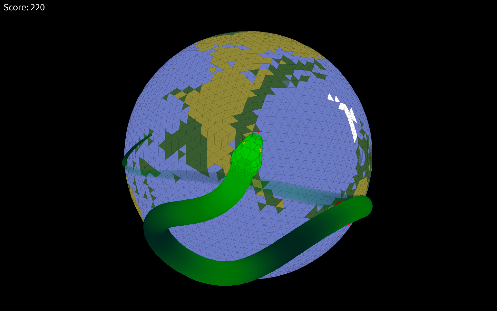
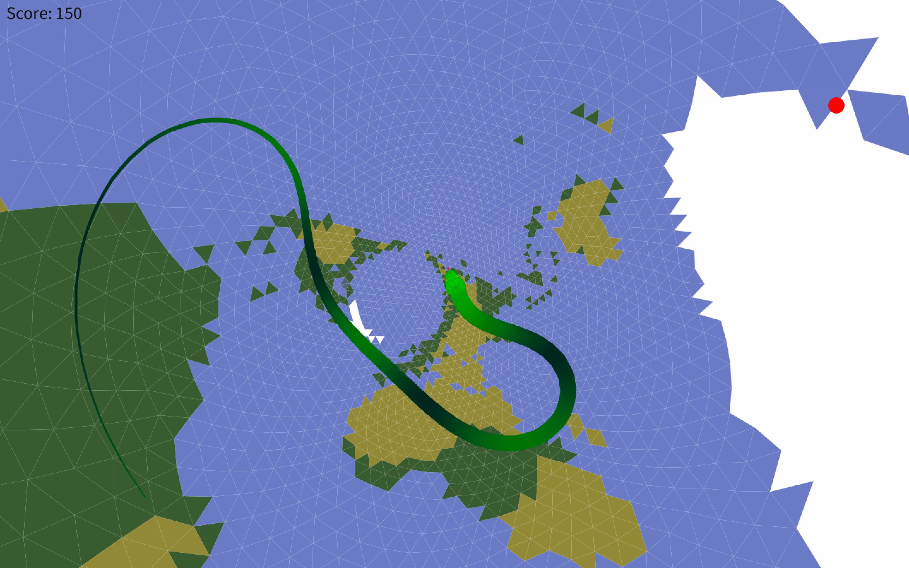
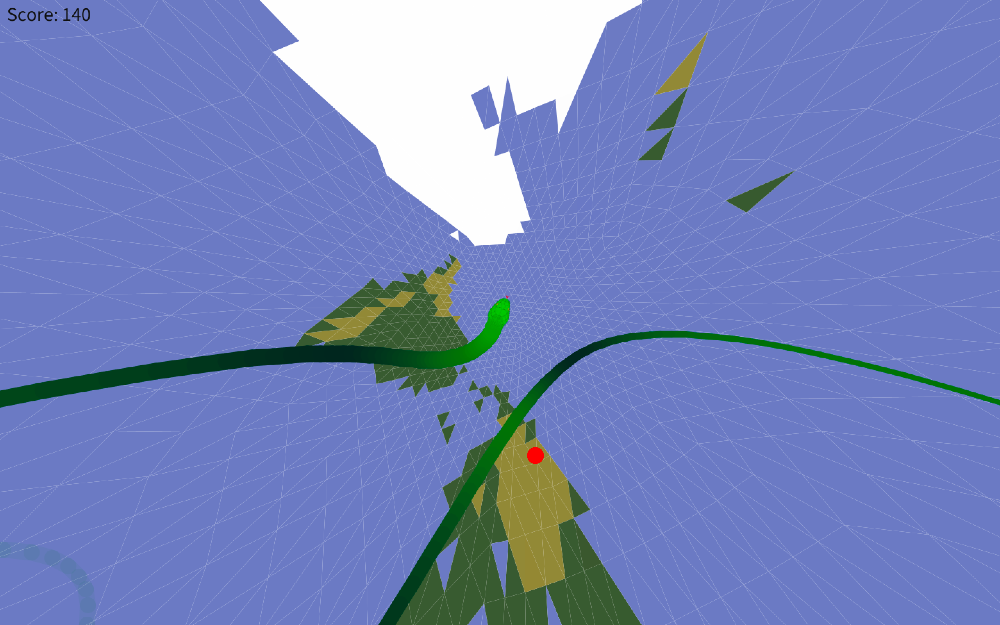
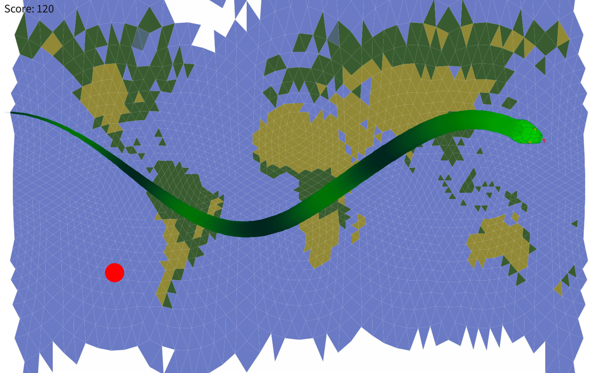

# Spherical Snake 
The classical game of snake, but played on a sphere.

You are a green snake that lives on a sphere, and wants to eat red fruit without crashing into yourself. You move at a constant speed and steer with the arrow keys.

Use Z and X to zoom in and out; use E and R to switch between the earth and the rainbow texture; and use O, S, G, M and N to change between orthographic, stereographic, gnomonic, standard mercator and centered mercator projections respectively

